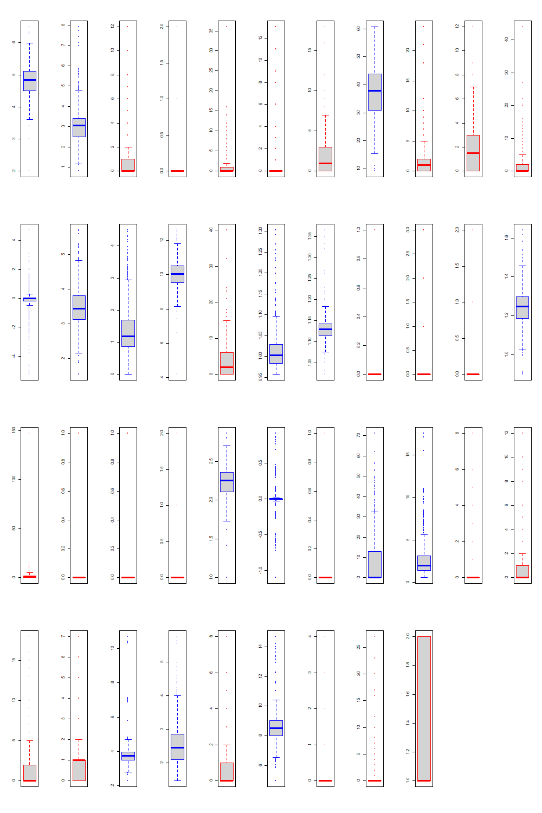
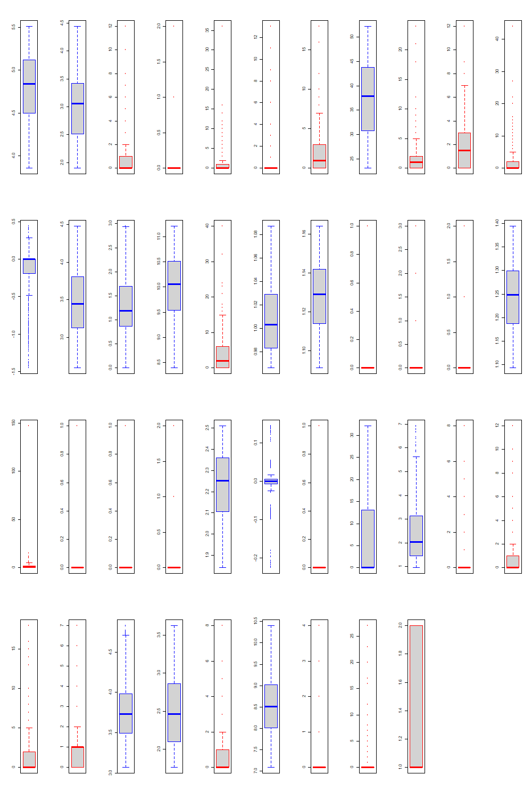
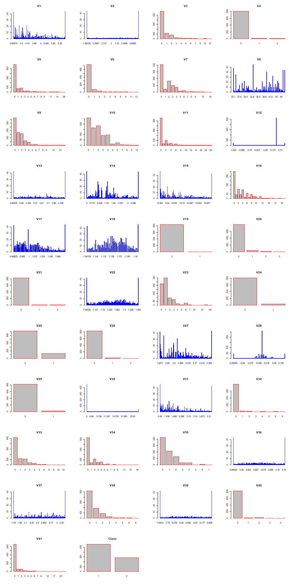

```{r setup, include=FALSE}
knitr::opts_chunk$set(echo = TRUE)
library(PerformanceAnalytics)
library(arules)
library(purrr)
library(pryr)
library(pROC)
library(MASS)
library(naivebayes)
library(randomForest)
library(e1071)
```

## Exploration

```{r}
data <- read.csv("train.csv")
df <- data
testing_data <- read.csv("test.csv")
head(data)
```

We prepared some functions to help us with the analysis.
```{r}
mcf <- function(data) {
    #' Return the major class frequency per each column
    return(sapply(data, function(x) max(table(x)) / sum(table(x))))
}
correlation <- function(data, threshold) {
    #' Return pairs of features with correlations above a threshold
    mat = cor(na.omit(data[, -ncol(data)]))
    mat[lower.tri(mat, diag = TRUE)] <- 0
    correlations <- which(abs(mat) > threshold, arr.ind = TRUE)
    rownames(correlations) <- NULL
    colnames(correlations) <- NULL
    annotated = t(apply(
        correlations,
        1,
        function(x) c(x[1], x[2], mat[x[1], x[2]])
    ))
    return(annotated)
}
```

### General data analysis
Percentage of rows with missing features:
```{r}
print(sum(apply(data, 1, function(x) any(is.na(x)))) / nrow(data))
```
Number of missing features per row:
```{r}
print(table(apply(data, 1, function(x) sum(is.na(x)))))
```
Total missing features by column:
```{r}
missing_values <- apply(data, 2, function(x) sum(is.na(x)))
print(missing_values[missing_values > 0])
```
Class counts:
```{r}
groups = split(data, data$Class)
print(sapply(groups, nrow))
```
Number of unique values per column:
```{r}
print(sapply(data, function(x) length(unique(x))))
```
Major class frequency per column:
```{r}
MCF = mcf(data)
print(MCF)
print(MCF[MCF > 0.95])
```
Correlation between features:
```{r}
print(correlation(data, 0.90))
```
Variance of features:
```{r}
print(apply(data, 2, var))
```
Outliers per column:
```{r}
for (col in 1:ncol(data)) {
    s = colnames(data)[col]
    if (typeof(data[,col]) != "double")
        num = 0
    else 
        num = sum(
            data[,col] < quantile(data[,col], 0.05, na.rm=TRUE) |
            data[,col] > quantile(data[,col], 0.95, na.rm=TRUE)
        ) / length(data[,col])
    print(paste(s, num, sep=": "))
}
```

### Visualizations
```{r}
colour <- function(datatype) ifelse(datatype == "double", "blue", "red")

save_plots <- function(data, width, height, plot_function, plots_per_page = c(1,1), plot_count=NaN, filename=function(page) page) {
    #' Generate N plots
    if (is.na(plot_count)) plot_count = ncol(data)
    if (typeof(filename) == "character") filename = local(function(page) filename, list2env(list(filename=filename)))
    for (page in 1:floor(plot_count / prod(plots_per_page))) {
		    name = as.character(filename(page))
        png(paste(name, ".png", sep=""), width, height)
        par(mfrow=plots_per_page)
        start = (page-1) * prod(plots_per_page) + 1
        end = min(plot_count, page * prod(plots_per_page))
        for (col in start:end) {
            plot_function(col)
        }
        dev.off()
    }
}
save_boxplots <- function(data, width=1000, height=1500, filename="boxplot") {
    #' Generate boxplots of each column
    save_plots(
        data=data,
        width=width,
        height=height,
        plot_function=function(col)
            boxplot(data[,colnames(data)[col]], width=1, border=colour(typeof(data[,col]))),
        plots_per_page=c(4,11),
		filename=filename
    )
}
save_barplots <- function(data, width=1000, height=2000, filename="barplot") {
    #' Generate barplots of each column
    save_plots(
        data=data,
        width=width,
        height=height,
        plot_function=function(col)
            barplot(table(data[,col]), main=colnames(data)[col], border=colour(typeof(data[,col]))),
        plots_per_page=c(11,4),
		filename=filename
    )
}
save_scatterplots <- function(data, width=10000, height=10000, filename="scatterplot") {
    #' Generate scatterplots of each column, colour them by class
    save_plots(
        data=data,
        width=width,
        height=height,
        plot_function=function(col)
            pairs(data, col=adjustcolor(c("red", "blue", alpha=0.5)[data$Class])),
        plots_per_page=c(1,1),
        plot_count=1,
		filename=filename
    )
}

# TODO: uncomment
# save_boxplots(df, filename="images/boxes")
# save_boxplots(outliers.winsorize(df), filename="images/boxes_winsorized")
# save_barplots(outliers.winsorize(df), filename="images/histograms")
# save_scatterplots(df, filename="images/scatters")
# save_scatterplots(transform.pca(impute.mean(df)), filename="images/scatters_pca")
```

The following plots were generated from the data (blue = continuous, red = categorical):





After analyzing the data, we found the following:
* ~10% of rows have a missing value (all but one are missing precisely one value)
* Most of the missing data appear in the same few columns.
* There are 2 classes with prior probabilities of 2/3 and 1/3.
* We counted unique values per column to determine which columns are categorical and which are continuous.
* 7 attributes have a majority class frequency of 0.95 or higher. These are likely to be useless.
* 4 pairs of attributes have a correlation of 0.90 or higher. These are likely to be redundant.
* None of the continuous columns had a significantly low variance.
* Several columns had a high percentage (up to 10%) of outliers.

## Preprocessing transformers

In light of the findings above, we designed the following transformers:

```{r}
dist <- function(datum, data) {
    #' Calculate the distance from datum to each row in data
    return(apply(data, 1, function(x) sqrt(sum((as.integer(datum) - as.integer(x))^2))))
}

transform.pca <- function(data) {
    #' Transform data using PCA
    pca <- prcomp(data[,-ncol(data)], center=TRUE, scale=TRUE)
    ret = data.frame(pca$x)
    ret$Class <- data$Class
    return(ret)
}

outliers.winsorize <- function(data, threshold=0.05) {
    #' Winsorize outliers
    for (i in 1:ncol(data)) {
        if (typeof(data[,i]) != "double") next
        quantiles <- quantile(
            data[,i],
            probs=c(threshold, 1-threshold),
            na.rm=TRUE
        )
        data[,i] <- ifelse(data[,i] < quantiles[1],
            quantiles[1],
            ifelse(data[,i] > quantiles[2],
                quantiles[2],
                data[,i]
            )
        )
    }
    return(data)
}

impute.mean <- function(data) {
    #' Impute missing values with the mean of the column
    for (i in 1:ncol(data)) {
        if (typeof(data[,i]) %in% c("double", "integer")) {
            data[,i] <- ifelse(is.na(data[,i]),
                mean(data[,i], na.rm=TRUE),
                data[,i]
            )
        }
    }
    return(data.frame(data))
}
impute.filter <- function(data) {
    #' Remove rows with missing data
    return(data[complete.cases(data),])
}
impute.knn <- function(data, k=1) {
	#' Impute using k nearest neighbours
    to_impute = data[!complete.cases(data),]
    for (row in rownames(to_impute)) {
        incomplete_row = colnames(data[row,])[apply(data[row,], 2, anyNA)]
        incomplete_filter = (names(data[row,]) %in% incomplete_row) # booleans
        distances = dist(data[row,!incomplete_filter], data[complete.cases(data),!incomplete_filter])
        k_nearest = data[complete.cases(data),][order(distances)[1:k],]
        
        # replace only na's
        for (col in incomplete_row) {
            if (typeof(data[,col]) %in% c("double", "integer")) {
                data[row,col] <- ifelse(is.na(data[row,col]),
                    mean(k_nearest[,col], na.rm=TRUE),
                    data[row,col]
                )
            }
        }
    }
    return(data.frame(data))
}

prune.mcf <- function(data, cutoff = 0.95) {
    #' Prune features with major class frequency > cutoff
    MCF = mcf(data)
    return(data[, names(MCF[MCF <= cutoff])])
}
prune.variance <- function(data, cutoff = 0.1) {
    #' Prune features with variance < cutoff
    return(data[, apply(data, 2, function(x) var(x, na.rm=TRUE)) >= cutoff])
}
prune.correlated <- function(data, threshold) {
    #' Prune features that are highly correlated with each other
    correlations = correlation(data, threshold)
    return(data[, !colnames(data) %in% correlations[,1]])
}
```


## Classifiers

```{r}
classify.majority.train <- function(data, params) {
    #' Train a majority class classifier
    return(names(which.max(table(data$Class))))
}
classify.majority.execute <- function(classifier, datum) {
    #' Classify using majority class
    return(classifier)
}

classify.random.train <- function(data, params) {
    #' Train a random classifier
    return(c())
}
classify.random.execute <- function(classifier, datum) {
    #' Classify using random class
    return(sample(2, 1))
}

classify.lda.train <- function(data, params) {
    #' Train a linear discriminant analysis classifier
    return(lda(Class ~ ., data=data))
}
classify.lda.execute <- function(classifier, datum) {
    #' Classify using linear discriminant analysis
    return(predict(classifier, datum)$class)
}

classify.bayes.train <- function(data, params) {
    #' Train a naive bayes classifier
    return(naive_bayes(Class ~ ., data=data, laplace=1))
}
classify.bayes.execute <- function(classifier, datum) {
    #' Classify using naive bayes
    return(predict(classifier, datum))
}

classify.random_forest.train <- function(data, params) {
    #' Train a random forest classifier
    return(randomForest(Class ~ ., data=data))
}
classify.random_forest.execute <- function(classifier, datum) {
    #' Classify using random forest
    return(predict(classifier, datum))
}

classify.svm.train <- function(data, params) {
    #' Train a svm classifier
    return(svm(Class ~ ., data=data, gamma=params$gamma))
}
classify.svm.execute <- function(classifier, datum) {
    #' Classify using svm
    return(predict(classifier, datum))
}


# Combine classify.X.train and classify.X.execute into classify.X
# classify.X(training_data) returns a function that can be used to classify.
classifiers = c("majority", "random", "bayes", "lda", "random_forest", "svm")
for (classifier in classifiers) {
	train = match.fun(paste("classify.", classifier, ".train", sep=""))
	execute = match.fun(paste("classify.", classifier, ".execute", sep=""))

	name = paste("classify.", classifier, sep="")

	fun = local(function(training_data, parameters) {
		classifier = train(training_data, parameters)
        columns = names(training_data)
        columns = columns[columns != "Class"]
		return(function(testing_datum) {
            results = list()
            for (i in rownames(testing_datum)) {
                results[[i]] <- execute(classifier, testing_datum[i,columns])
            }
			return(results)
		})
	}, list2env(list(train=train, execute=execute)))
	assign(name, fun)
}

get_classifier = function(name, parameters=list()) {
    classifier = match.fun(paste("classify.", name, sep=""))
    return(local(function(training_data) {
        return(classifier(training_data, parameters))
    }, list2env(list(classifier=classifier, parameters=parameters))))
}
```

## Cross-validation and testing

We ran k-fold validation on the following metrics:  
* Accuracy  
* Precision  
* Recall  
* F1 score  
* AUC  

```{r}
metrics <- function(data, results) {
    contingency_table = table(factor(as.integer(results), c(1, 2)), factor(data$Class, c(1, 2)))
    
    tp = contingency_table[1,1] # true positive
    fp = contingency_table[1,2] # false positive
    fn = contingency_table[2,1] # false negative
    tn = contingency_table[2,2] # true negative
    p = tp + fn # positive
    n = tn + fp # negative
    pp = tp + fp # predicted positive
    pn = tn + fn # predicted negative

    shita = as.vector(data$Class, mode="numeric")
    shitb = as.vector(results, mode="numeric")
    return(list(
        "Accuracy"=((tp+tn)/(tp+tn+fp+fn)),
        "F1"=(2*tp/(2*tp + fp + fn)),
        "Precision"=(tp/pp),
        "Recall"=(tp/p),
        "AUC"=(roc(shita, shitb, quiet=TRUE)$auc)
    ))
}

k_fold_validate <- function(data, k, classifier) {
    #' Perform k-fold cross validation on a dataset
    data = data[sample(nrow(data)),]
    fold_size = round(nrow(data) / k)
    fold_indices = seq(1, nrow(data), fold_size)
    fold_indices = c(fold_indices, nrow(data)+1)
    fold_accuracies = array(0, c(k, 5))
    for (fold in 1:k) {
        test_indices = seq(fold_indices[fold], fold_indices[fold+1]-1)
        fold_data = data[-test_indices,]
        fold_test = data[test_indices,]
        fold_classifier = classifier(fold_data)
        fold_accuracies[fold,] = as.numeric(metrics(fold_test, fold_classifier(fold_test)))
    }
    return(fold_accuracies)
}
```

```{r}
df$Class = as.factor(df$Class)
testing_data$Class = as.factor(testing_data$Class)
```


```{r}
preprossesses = list(
    "LDA"=function(data) {
        preprossess = compose(impute.knn, prune.variance)

        datalda = preprossess(data)
        lda_classifier = classify.lda.train(datalda)
        data[,ncol(data) + 1] = predict(lda_classifier, datalda)$x[,1]
        testing_data[,ncol(testing_data) + 1] = predict(lda_classifier, testing_data)$x[,1]

        return(preprossess(data))
    },
    "PCA"=function(data) {
        preprossess = compose(impute.knn, prune.variance)
        data[,(ncol(data) + 1):(ncol(data) + 3)] = transform.pca(preprossess(data))$x[,1:3]
        return(preprossess(data))
    },
    "knn+var"=compose(impute.knn, prune.variance),
    "prep1"=compose(outliers.winsorize, prune.mcf, prune.variance, impute.knn),
    "prep2"=compose(impute.knn, outliers.winsorize, prune.mcf, prune.variance),
    "prep3"=compose(impute.knn, prune.mcf, prune.variance, outliers.winsorize),
    "prep4"=compose(impute.knn, prune.variance, outliers.winsorize)
)

clacifiers = list(
    "majority"=get_classifier("majority"),
    "random"=get_classifier("random"),
    "bayes"=get_classifier("bayes"),
    "lda"=get_classifier("lda"),
    "random_forest"=get_classifier("random_forest"),
    "svm"=get_classifier("svm", list(gamma=0.1))
)

results = array(0, 
    c(length(clacifiers),length(preprossesses), 5),
    dimnames=list(
        names(clacifiers),
        names(preprossesses),
        c("Accuracy","F1","Precision","Recall","AUC")
    )
)

i=1
for (classifier in clacifiers) {
    j=1
    for (preprossess in preprossesses) {
        print(paste(names(clacifiers)[i], names(preprossesses)[j], sep=" / "))
        results[i,j,] = colMeans(k_fold_validate(preprossess(df), 5, classifier))
        j = j + 1
    }
    i = i + 1
}

print(results)
```

The best classifier (according to the accuracy metric) turned out to be the random forest classifier with the 4th preprossessing preset (impute.knn <- prune.variance <- outliers.winsorize).
We ran these settings on the test dataset to evaluate our true success.
```{r}
classifier = classify.random_forest(preprossesses[["prep4"]](df))
results = c()
for (row in rownames(testing_data)) {
    test = testing_data[row, names(testing_data) != "Class"]
    results = c(results, tryCatch(as.integer(classifier(test)), error=function(e) "error"))
}
contingency_table = table(results, testing_data$Class)

print(contingency_table)

print(sum(diag(contingency_table))/sum(contingency_table))
```
